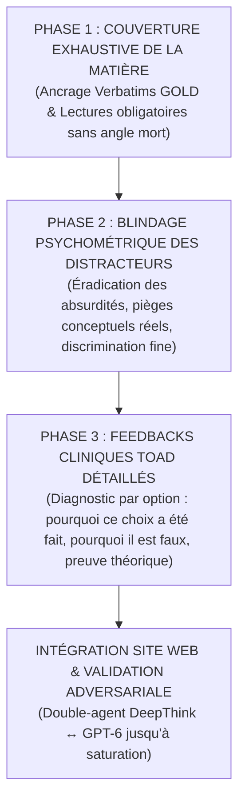

# 🏛️ CADRE MÉTHODOLOGIQUE DE CONCEPTION PSYCHOMÉTRIQUE & PÉDAGOGIQUE
## Cours : PSY9613 — Perception, cognition et IA | Examens 1 & 2 (UQAM)
### Auteurs : Michel Mercier & Antigravity (Tour de Contrôle Pédagogique)

---

## 📜 1. LA VISION FONDATRICE (DIRECTIVE MICHEL MERCIER — 25 SEPTEMBRE 2026)

La conception des banques d'évaluation sommative et formative pour le site web et la préparation aux examens de maîtrise/doctorat ne doit jamais procéder au hasard ou par génération automatique superficielle (« AI slop »). Elle repose sur une progression séquentielle stricte en **trois phases interdépendantes** :

---

## 🔍 2. DÉTAIL DES TROIS PHASES D'INGÉNIERIE PÉDAGOGIQUE

### 📍 PHASE 1 : Couverture Exhaustive & Fidélité Empirique Absolue
- **Ancrage exclusif :** Chaque question doit être rattachée à un point formellement débattu oralement par les professeurs (Dave Saint-Amour ou Pierre Poirier) dans les transcriptions GOLD ou présent dans les textes obligatoires certifiés.
- **Règle d'or de Poirier :** Aucune question ne doit porter sur un micro-détail ésotérique ignoré en classe.
- **Zéro angle mort :** Tous les piliers d'une séance (8 piliers pour la Séance 1, 9 piliers pour la Séance 2) doivent être couverts par au moins 2 à 3 questions de niveaux différents.

### 📍 PHASE 2 : Conception Rigoureuse des Distracteurs (Haute Plausibilité)
- **Éradication de l'absurde :** Interdiction absolue de distracteurs loufoques, télépathiques, caricaturaux ou éliminables par simple déduction de bon sens sans connaître le cours.
- **Les 4 types de distracteurs doctoraux obligatoires :**
  1. *L'Inversion Paramétrique :* Inversion de formules ou de conventions de signe (ex: $c > 0$ vs $c < 0$, $d'$ vs $\beta$).
  2. *L'Assimilation Abusive :* Fusion erronée de deux concepts voisins mais distincts (ex: Affordance écologique directe de Gibson vs Affordance perçue de Norman ; Activations $a$ vs Poids $w$ en PDP).
  3. *La Faute d'Attribution Expérimentale :* Confusion de paradigmes (ex: Illusion de Ponzo chez Jackson & Shaw vs Ebbinghaus chez Aglioti ; modulation de force vs cinématique spatiale).
  4. *La Généralisation Excessive :* Transformer un résultat conditionnel ou contingent en loi universelle infaillible (ex: dégradation gracieuse absolue sans seuil non-linéaire).
- **Équiprobabilité des clés :** Répartition statistique rigoureuse des réponses correctes (25 % de A, 25 % de B, 25 % de C, 25 % de D). Interdiction formelle du biais de complaisance envers B.

### 📍 PHASE 3 : Rétroactions Cliniques Toad Personnalisées par Option
L'outil d'étude sur le site web doit transformer l'erreur en opportunité métacognitive. Pour chaque question, les 4 options (la bonne et les 3 fausses) doivent impérativement comporter un diagnostic Toad structuré :
- **Pour l'option correcte :**
  * Validation du raisonnement exact.
  * Ancrage théorique fondamental (formule, auteur, année, citation textuelle).
  * Conseil d'examen (*Exam Tip*) résumant l'équation conceptuelle à mémoriser.
- **Pour chaque option incorrecte :**
  * *Diagnostic de la méprise :* « Tu as probablement choisi cette option parce que... » (identification de la confusion typique de l'étudiant).
  * *Réfutation clinique :* Démonstration précise de la faille théorique ou mathématique.
  * *Preuve documentaire :* Référence directe au texte ou au verbatim contredisant l'option.

---

## 🔄 3. LE CYCLE ADVERSARIAL DE PERFECTIONNEMENT PERMANENT (DeepThink ↔ GPT-6)

1. **Génération / Refonte par DeepThink :**
   DeepThink élabore les blocs de questions selon la grille étalon-or.
2. **Audit Impitoyable par GPT-6 :**
   GPT-6 traque les ambiguïtés, les distracteurs faibles, les attributions erronées et vérifie la validité des preuves.
3. **Contre-Attaque & Réécriture par DeepThink :**
   DeepThink intègre chirurgicalement chaque critique et durcit les distracteurs.
4. **Saturation Asymptotique & Clôture :**
   Le processus boucle jusqu'à ce que le gain marginal $\Delta \le 1\%$ et que GPT-6 accorde la certification étalon-or.
5. **Conservation de la Méthode :**
   Ce cadre est le standard officiel à reproduire pour la Séance 3 (Théorie de l'Information, Shannon, Hiérarchie Visuelle) et l'ensemble des modules futurs.
