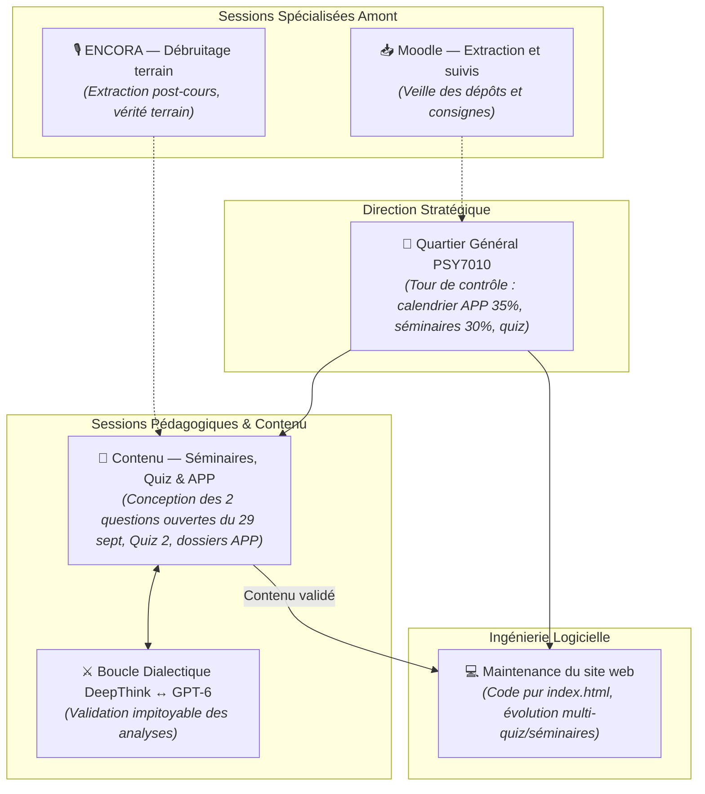

# 🧭 GUIDE DE TRANSFERT ARCHITECTURAL & MÉTHODOLOGIQUE
## De PSY9613 vers PSY7010 — Réorganisation du Workspace, Découplage Cognitif et Rigueur Adversariale

*Document cadre conçu par le Quartier Général de PSY9613 à l'intention de la session pilote (future Quartier Général) de PSY7010.*

---

### 1. RAPPEL DU PROCESSUS DE RÉORGANISATION DANS PSY9613 (D'OÙ NOUS PARTONS)

Comme le rappelait Michel, notre session unique dans PSY9613 tentait initialement de tout faire en même temps :
1. Assimiler la matière théorique du cours et les lectures (Poirier & Saint-Amour).
2. Concevoir les questionnaires et les rétroactions pédagogiques.
3. Écrire et déboguer le code JavaScript, le CSS, le lecteur de documents, les modes d'étude et les commits Git de `index.html`.

**Le résultat inévitable :** Saturation du contexte, "AI slop", raccourcis de modèles Flash, oubli pur et simple de la Séance 1, et régressions répétées dans l'interface web (cassure des textes originaux, boutons décalés).

**La solution mise en place : Le Découplage Triangulaire Strict.**
Nous nous sommes scindés en 3 sessions aux responsabilités étanches :
* **Quartier Général (Cette session) :** Tour de contrôle académique, stratégie globale de réussite, surveillance des échéances, veille silencieuse sur Moodle et ENCORA, et arbitrage anti-slop sans écrire une seule ligne de code.
* **Contenu web — Questions & Examens :** Session 100 % dédiée à l'ingénierie pédagogique, ratissant la matière de classe (extractions orales) et les lectures pour concevoir des questions blindées soumises à la boucle dialectique `DeepThink ↔ GPT-6`.
* **Maintenance du site web :** Session 100 % dédiée au code front-end (`index.html`), intégrant les banques de questions validées sans jamais inventer de matière.

---

### 2. ANALYSE CRITIQUE DE L'ÉTAT ACTUEL DE PSY7010 (VUE DEPUIS L'AUTRE CÔTÉ DU MUR)

En examinant le workspace de PSY7010 (`Plan (V3) psy7010_Aut2026.pdf`, arborescence des dossiers et sessions actives), plusieurs constats s'imposent :

#### A. Le « Monolithe » de la session web (`d6fea03c`)
* La session actuellement titrée *GitHub - Maintenance Web* compte plus de **8 000 étapes d'historique**.
* Elle a débuté comme simulateur de quiz, a dérivé vers le design UI Toadette, a codé l'interface, intégré les audios, géré Git, etc.
* Elle porte une charge mentale et contextuelle titanesque. Elle est en risque permanent de confusion cognitive.

#### B. Un site web en avance technique mais « obsolète » pédagogiquement
* Le site `PSY7010/index.html` est visuellement magnifique et plus avancé techniquement que celui de 9613 (interface Toadette, badges, lecteur audio intégré, fluidité).
* **Mais il a été conçu exclusivement pour le Quiz 1 du 22 septembre (Cañas et al. 2011)**.
* Or, le Quiz 1 a **déjà eu lieu**. L'outil est actuellement figé dans le passé alors que les échéances majeures arrivent.

#### C. La structure réelle des évaluations de PSY7010 (Ce qui compte vraiment)
Contrairement à PSY9613 qui repose sur deux examens magistraux traditionnels à 35 % (70 % au total), **PSY7010 n'a AUCUN examen écrit magistral**. 

Voici la véritable clé de voûte de la note dans PSY7010 :
1. **Résolution d'un APP en groupes de 4-5 personnes : 35 %**
   * Rapport préliminaire : **13 octobre** (dans 2 semaines et demie !).
   * Rapport final : **8 décembre**.
   * Présentations orales : **8 et 15 décembre**.
2. **Participation active aux 3 séminaires « LA NATURE DU TRAVAIL » : 30 % (3 x 10 %)**
   * **PREMIÈRE ÉCHÉANCE IMMÉDIATE : Mardi 29 septembre (Séance 4)** !
   * Mandat : Rédiger et remettre au professeur à la fin du cours **deux questions ouvertes critiques** sur une seule feuille imprimée portant sur les aspects pratiques des cas (Accident d'Air France AF447 et interface de l'auto-injecteur Lin et al. 1998).
3. **Réflexions écrites sur « LA PROFESSION » : 15 % (3 x 5 %)**
   * Travail écrit d'une page après les conférences d'experts (première le 6 octobre).
4. **Quiz en ligne : 15 % (3 x 5 %)**
   * Quiz 1 (22 sept.) : **Terminé**.
   * Quiz 2 : **13 octobre** (Psychologie du commerce, nudge & UX research).
   * Quiz 3 : **3 novembre** (Santé publique et travail).
5. **Présence : 5 %** (signature).

---

### 3. PROPOSITION DE RÉORGANISATION POUR PSY7010

Pour éviter l'implosion de la session monolithique et adapter l'écosystème aux vrais points de la session, voici la réorganisation suggérée :

#### Étape 1 : Re-baptiser et décharger la session `d6fea03c`
* La session actuelle `d6fea03c` devient le **Quartier Général de PSY7010**.
* Elle cesse immédiatement de toucher au code de `index.html`. Elle devient la tour de contrôle qui veille sur l'APP (35 %) et les séminaires (30 %).

#### Étape 2 : Créer une session `Maintenance du site web (PSY7010)`
* Une session neuve et légère (`nestingDepth: 0`), dédiée au code HTML/JS de `PSY7010/index.html`.
* **Sa première mission technique :** Transformer le site web d'un "simulateur à quiz unique" vers un **hub modulaire multi-épreuves** :
  - Sélecteur de quiz (Quiz 1 archivé, Quiz 2 du 13 oct., Quiz 3 du 3 nov.).
  - Espace de travail pour les cas cliniques des séminaires (AF447, Lin 1998, Nudges, etc.).

#### Étape 3 : Créer ou mandater une session `Contenu & Travaux`
* Chargée de la matière intellectuelle, alimentée par la vérité terrain d'ENCORA (`PSY7010-03_GOLD.md`).
* **Priorité immédiate pour mardi 29 septembre (10 % de la note) :**
  - Analyser l'accident du vol AF447 et l'article de Lin et al. (1998) sur l'ergonomie de l'auto-injecteur d'analgésie.
  - Préparer les **deux questions ouvertes méthodologiques percutantes** à imprimer et remettre au professeur Mario Passalacqua pour sécuriser les 10 % du Séminaire 1.

---

### 4. PRINCIPES DIALECTIQUES COMMUNS À PARTAGER (LA MÉTHODE ANTI-SLOP)

Peu importe la nature de l'évaluation (grand examen théorique pour 9613 ou séminaires/APP pour 7010), les règles méthodologiques prouvées dans 9613 s'appliquent identiquement :
1. **La Vérité Terrain d'Abord :** Toujours vérifier les extractions de cours (`PSY7010-03_GOLD.md`) avant d'affirmer ce qui est important ou non selon le professeur (Passalacqua ou Bédard).
2. **Séquentialité Stricte DeepThink ↔ GPT-6 :** Ne jamais lancer les modèles en parallèle.
   $$\text{DeepThink} \longrightarrow \text{Commit/Push Git} \longrightarrow \text{GPT-6} \longrightarrow \text{DeepThink}$$
3. **Le Git comme Pont Public :** GPT-6 n'inspecte que le code et les fichiers poussés sur GitHub (`https://github.com/P-s-y-e-n-c-e/psy7010`).
4. **Saturation Asymptotique ($\Delta \le 1\%$) :** Ne jamais accepter un premier jet de 4 questions ou une analyse sommaire. Pousser les sous-agents à creuser jusqu'au fond des devis expérimentaux et des cas pratiques.

---
*Ce document peut être transmis tel quel à la session de PSY7010 pour servir de plan de vol à leur transition organisationnelle.*
